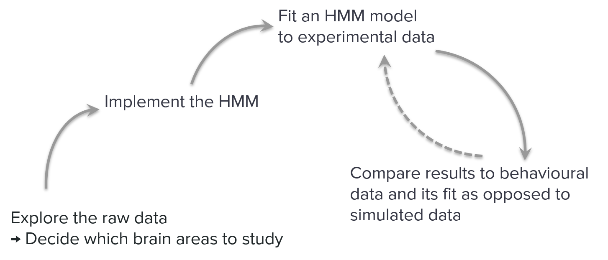
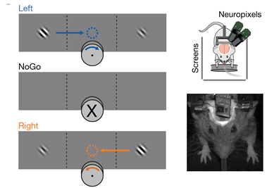
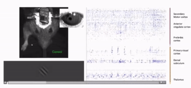
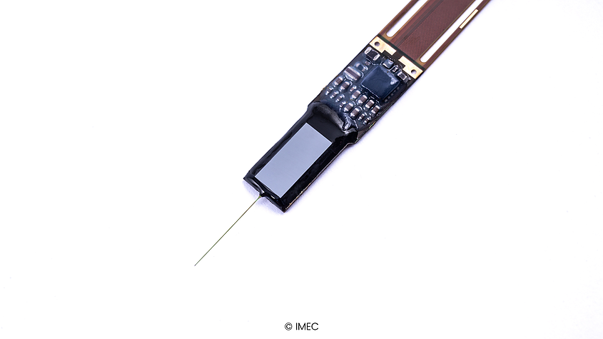
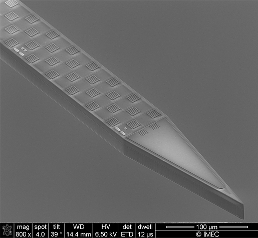
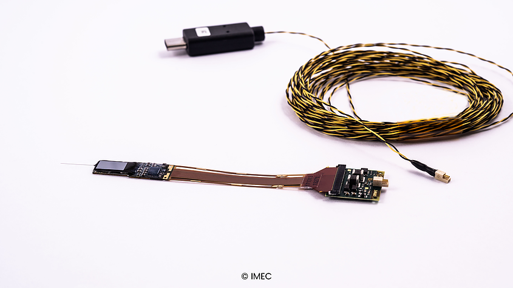
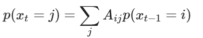
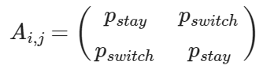

# What is Neuromatch Academy?

The [Neuromatch Academy](https://neuromatch.io/academy) was an online computational neuroscience summer school which covered everything from introduction to modelling, statistics to machine learning/deep learning.

#### **The Organizers and Sponsors:**

The entire syllabus can be [found here](https://github.com/NeuromatchAcademy/course-content), and the entire Academy is open source, with all of the [lectures and tutorials](https://github.com/NeuromatchAcademy/course-content/tree/master/tutorials) available on YouTube and GitHub.

**For an interactive student like me, an average day looked something like:**

- **08.00 AM** - Project work and team meeting
- **09.30 AM** - Watching the keynote which explains what topic will we cover that day
- **10.00 AM** - Pod (8 people) video-conference where we split up into teams of four and live code the solutions to the tutorials and assignments
- **02.00 PM** - Watching the outro which explains why the topic covered was important, and where is it used
- **03.00 PM** - Live QA with the content creators for that day
- **03.30 PM** - Live QA with TAs about the content for that day
- **04.00 PM** - Project work with the team, until the late evening

It was a lot of work, but a lot of fun. And it was way out of my comfort zone, as a software engineer.

# Why did I attend and how did I prepare?

**I applied** because I really wanted to get my feet wet in computational neuroscience, **since I was interested in spiking neural networks (SNNs) and neuromorphic hardware**, and this gave me an opportunity to learn the background knowledge necessary and do some actual project work with real spiking data.

Like I said, it was way out of my comfort zone, so I had to do a lot of preparing to make the most out of the course. The course creators even made a list of [prerequisites for attending](https://github.com/NeuromatchAcademy/precourse):

### **Programming**:

Of course, we used Python during the entire course.  For students that never worked with Python, they even held a Python workshop.

They recommended: 

- The [Software carpentry 1-day Python tutorial](https://swcarpentry.github.io/python-novice-inflammation/);
- [scipy lecture notes](https://scipy-lectures.org/) and;
- The [Python data science handbook](https://jakevdp.github.io/PythonDataScienceHandbook/). 

Since I was already pretty experienced with Python, I just skimmed through the first two resources.

### **Math skills:**

Computational neuroscience and neural data analysis relies on linear algebra, basic statistics, and calculus (derivates and ODEs).

I used the following resources:

- For **linear algebra**:
  - I watched **[3Blue1Browns Essence of Linear Algebra series](https://www.youtube.com/playlist?list=PLZHQObOWTQDPD3MizzM2xVFitgF8hE_ab)** as a refresher and then;
  - I worked through these [linear algebra in Python excercises](https://www.w3resource.com/python-exercises/numpy/linear-algebra/index.php) - [solutions here](https://github.com/ivanorsolic/NMAProject-HMM/blob/master/course-prep/Linear%20algebra%20in%20Python.md).
- For **calculus**:
  - I read **[Gilbert Strang's Calculus book](https://ocw.mit.edu/ans7870/resources/Strang/Edited/Calculus/Calculus.pdf)**, which was an excellent refresher.
  - I read and did the exercises in **["Jiri Lebl's "Differential equations for engineers"](https://www.jirka.org/diffyqs/)** in chapters 0 and 1.
- For **statistics**:
  - I read **[Russ Poldrack's "Statistical thinking of the 21st century"](https://statsthinking21.github.io/statsthinking21-core-site/)**

### Neuroscience:

To learn at least some fundamentals, I did [**Harvard's "Fundamentals of Neuroscience" series**](https://online-learning.harvard.edu/series/fundamentals-neuroscience), which consisted of three courses, and was absolutely great for getting my feet wet.

# What did I learn?

When I applied, I had no idea that I'd learn such a broad amount of topics in such a short time, all while actually implementing most of the stuff myself.

**The entire course was well worth it, but I can list a few of my favorite lectures from each week:**

- [**Optimal control**](https://github.com/NeuromatchAcademy/course-content/blob/master/tutorials/README.md#w2d4---optimal-control) from Week 2, Day 4:
  - Through the second tutorial called **Optimal Control for Continuous State** we explored a **Linear Dynamical System (LDS) with Open-Loop and Closed-Loop Controls**, through the example of flying a spacecraft through space from Earth.
  - We **designed and implemented an optimal control input using a linear quadratic regulator (LQR)**
  - We **tracked a time-varying goal using LQR** - in this case it meant designing a preliminary control action which took into account the constant movement of the craft through space, and predicted its position at the next time step.
  - Lastly, **we used a Linear Quadratic Gaussian (LQG) controller to control a partially observed state**.
    - Due to noisy measurements of the craft's position and state, we had to estimate the true state (using a **Kalman filter**) and then design an action based on that estimate (**using an LQR**), which combined is known as a **Linear Quadratic Gaussian (LQG) controller**
  - For me, this was equal parts hard and fascinating. I had no idea we'd be doing stuff like this at a computational neuroscience school!
- [**Real Neurons**](https://github.com/NeuromatchAcademy/course-content/blob/master/tutorials/README.md#w3d1---real-neurons) from Week 3, Day 1:
  - This is what I signed up for! And I'm glad that it's just a small part of everything I've learned during the Academy.
  - **The absolute best part about this day**, for me, **is that we actually did all of the math and implemented it**, starting from **the Leaky Integrate-and-Fire model** to modeling **Short-term synaptic plasticity** and **Spike-timing dependent plasticity**.
  - It was just a great day for me, since I got to know how some mathematical models of neurons work at a very low level, and even got to implement them.

- [**Modeling Practice**](https://github.com/NeuromatchAcademy/course-content/blob/master/tutorials/README.md#w1d2---modeling-practice) from Week 1, Day 2:

  - This was just the second day, but man were we off to an interesting start.

  - **We went through the entire modelling process, from framing the question to model implementation, testing and refinement.**

  - The phenomenon we were investigating was **the train illusion**, when we sometimes falsely perceive the world to be moving, when it is in fact ourselves that are moving (and vice versa).

  - We went through all of the research and modelling steps, and came up with a mathematical model that explained why the illusion occurs, given the vestibular signal from the inner ear and the visual signal from the eyes:

    

# The project

One of the biggest parts of the interactive student track was the project we had to implement in order to successfully complete the Academy. 

My team consisted of three people:

- **Asude** **Aydin** - Currently studying for her MSc in **Neural** **Systems &** **Computation** at (both 😳) ETH & UZH Zürich, Switzerland
- **Marcel Jüngling** - Doing his PhD at the **Max Planck Institute for Brain Research**, Frankfurt
- And me!

## TL;DR

For the project topic, we had to choose a research topic of interest for a practical project through which we would apply our newfound computational neuroscience skills and tools.

There were a number of [suggested topics](https://docs.google.com/presentation/d/1WAHfJcBPM4rmwwvreAAS92sRYtltJRwklxH-82NzCYo) and five [curated datasets](https://www.youtube.com/playlist?list=PLkBQOLLbi18ODTckxhgah98JloMLXt4oF) to choose from.

We went with our own project idea, and used one of the proposed datasets. 

The dataset was spiking neural data collected using [large-scale electrode arrays](https://www.neuropixels.org/) containing neural data from a number of brain regions recorded from [a mouse trained on a visual discrimination task](https://www.nature.com/articles/s41586-019-1787-x).

**We fitted a [Hidden Markov Model](https://www.wikiwand.com/en/Hidden_Markov_model)** using neurons from the primary visual cortex ([V1](https://www.wikiwand.com/en/Visual_cortex#/Primary_visual_cortex_(V1))) and the secondary motor cortex ([M2](https://www.wikiwand.com/en/Motor_cortex#/The_supplementary_motor_cortex)) and correlated it to the behavioral data (like stimulus onset, reaction time) to see if we could **describe neural activity in the cortices by discrete state sequences**, and if those **sequences correlated with behaviour**.

**The results:**

- **In the primary visual cortex the states we found did not seem to reflect behaviour very well.**

- **In the secondary motor cortex it was possible to map the behavior to three discrete states**: 
  - A short phase of movement initiation;
  - A locomotion phase;
  - A phase that corresponded to no movement.

- We concluded that in M2, cortical activity might actually unfold as a sequence of discrete states. 

- In the case of V1 we concluded that a lack of data prevented us from successfully would be needed for a proper statistical analysis:
  - We simulated more neural data using firing rates and the distribution from the actual data.
  - We successfully fitted a 3-state HMM to the simulated data.
  - The limiting factor seemed to be the amount of data used, since there were only 29 high-quality trials of real V1 data for our purposes.

The final project presentation (5 minutes) can be seen below:

<iframe width="560" height="315" src="https://www.youtube.com/embed/KKw8iO047jE" frameborder="0" allow="accelerometer; autoplay; encrypted-media; gyroscope; picture-in-picture" allowfullscreen></iframe>

## The background of the idea

In 1995., a paper called [Cortical activity flips among quasi-stationary states](https://pubmed.ncbi.nlm.nih.gov/7567985/) (by Abeles *et al*.) analysed parallel recordings of spike trains of several single cortical neurons in behaving monkeys as hidden Markov processes. 

The research indicated the existence of well-separated (discrete) states of activity, within which the firing rates were approximately stationary. It showed that six to eight such states could be reliably discriminated, and that different behavioral modes and stimuli were consistently reflected by each of those states.

**Over time, research** like:

- ["Detecting Neural-State Transitions Using Hidden Markov Models for Motor Cortical Prostheses"](https://web.stanford.edu/~shenoy/GroupPublications/KemereEtAlJNeurophysiol2008.pdf) (by Caleb Kemere *et al*.) 
- "[Expectation-induced modulation of metastable activity underlies faster coding of sensory stimuli"](https://www.nature.com/articles/s41593-019-0364-9) (by L. Mazzucato *et al*.) 
- ["Dynamics of Multistable States during Ongoing and Evoked Cortical Activity"](https://www.jneurosci.org/content/35/21/8214)  (by L. Mazzucato *et al*.) 

**Has shown that cortical activity in areas like the primary gustatory cortex unfolds as discrete state sequences. These state sequences are thought to be representations of internal variables and behaviour.**

Complex behaviour (e.g. performing a decision-making task) is encoded by neuronal firing of various brain areas that are structurally and functionally highly interconnected (e.g. the visual cortex, cingulate cortex, amygdala and prefrontal cortex).

**As of yet, it is still unclear in which brain areas neural activity indeed unfolds as state sequences and how these sequences correlate across different brain areas and with behaviour.**

Which led us to **our scientific question**.

## The scientific question

- Can neural activity in the (mouse) cortex be described by discrete state sequences and if those sequences correlate with behaviour?
- How are state transitions correlated across brain areas? 
- Can we find differences in neural activity for correct and incorrect decisions?

## The project idea

We wanted to analyse single-trial population activity using Hidden Markov Models (HMMs) to investigate if neural activity unfolds as state sequences.

If it did

, we would compare those discovered state sequences for different stimuli, using neural data from a mouse trained on a visual discrimination task, and compare the results across two or more brain regions and for different behaviors (correct and incorrect decisions).

## Our predictions

- We expected to find state sequences in cortices which can be correlated to behaviour.
- We predicted that states in primary and higher cortices of the same sensory modality are related and that states in the primary cortices should precede those in higher cortices. 
- We also expected states between cortices of different sensory modalities to correlate. 
- In the visual cortex, we expected not to find differences between trials with correct and incorrect decisions (given that the mouse made a decision which involved turning the wheel).

## What would the results mean if the predictions were true

- Neural activity in the cortical areas examined could be described by state sequences which reflect behaviour.
- We would be able to predict behaviour from neural activity (decoding).
- If a temporal delay was detected, this would demonstrate the existence of a cortical (visual) hierarchy in information processing.

## Possible alternative outcomes

- The state sequences couldn't be related to behaviour.
- There is a difference between trials with correct and incorrect decisions in the visual cortex.
- There is no temporal delay between state transitions across the visual hierarchy.

## Controls

We would mainly focus on correlating the neural activity with behaviour.

# Implementation

**The process would look something like this:**

- We would first explore the raw data:
  - To familiarize ourselves with what we've got
  - To decide which brain areas would be the best/easiest to study in this context
- We would then implement an HMM
- We would then fit the HMM to data from the brain areas we've chosen
- Finally, as a control, we would compare the results (detected states) to behavioural data and simulated data

## The dataset

We were given a set of [curated datasets](https://www.youtube.com/playlist?list=PLkBQOLLbi18ODTckxhgah98JloMLXt4oF) to choose from:

- [Stringer Dataset](https://youtu.be/78GSgf6Dkkk)
- [Steinmetz Dataset](https://youtu.be/WXn4-FpVaOo)
- [Kay/Gallant Dataset](https://youtu.be/LdJkLyw4yzg)
- [HCP Dataset](https://youtu.be/iOCcY0QFMS4)
- [IBL Dataset](https://youtu.be/NofrFH8FRZU)

**We went for the Steinmetz dataset since most of the prior work we found used spiking data, be it simulated or real, so we would have a much better starting point for our project.** This was also exciting for me since I got a chance to work with actual spiking data.

The [iPython notebook](https://colab.research.google.com/github/NeuromatchAcademy/course-content/blob/master/projects/load_steinmetz_decisions.ipynb) for the dataset already did some preprocessing for us (sorting the spikes, binning them to 10ms bins), and gave us a great starting point.

### Brief explanation of the experiment

In the Steinmetz paper, the mouse was trained on a **visual discrimination task**.

- There are three monitors in front and around the mouse.
- On the two monitors at each side of the mouse, stimuli with varying contrasts are shown, between which the mouse must identify the one with larger contrast, and bring it to the screen in front of it, using the wheel placed in front of it.

- Here's what it looks like visually:

### Neuropixels

If you look closely, you can see an electronic device implanted into the mouse's head. It's called a [Neuropixel probe](https://www.neuropixels.org/probe), and looks like this:

On their site, they say that:

> "Each probe features 384 dual-band, low-noise recording channels that can individually be configured to simultaneously record AP (action potential) and LFP (local field potential) signals from 960 selectable, low-impedance TiN electrodes densely tiled along a 10-mm long, 70 x 24 µm cross-section straight shank. Voltage signals are filtered, amplified, multiplexed and digitized on-chip, allowing the direct streaming of digital data from the probe."

It connects to a computer via USB-C:

**With it, the authors of the dataset ([Steinmetz et al., 2019.](https://www.nature.com/articles/s41586-019-1787-x)) recorded about 30 000 neurons from 42 brain regions.**

## Hidden Markov Models

We learned about them during the second week, on the third day of tutorials. The course creators neatly defined them as:

- "[...] a class of models that allow us to reason about the dynamics of a set of unobserved states that lead to the changing sensory inputs or data we observe."

They could be, and are, a topic unto itself, but I'll try to briefly describe the gist for the context of our project.

Based on our background research, we hypothesized that neural activity in some cortices of the brain can be described using discrete states, through which the brain switches back and forth, based on the activity occurring in the cortex.

- If we assume that those hidden states aren't fixed over time, or in other words, that the states switch over time, and;
- If the cortex can probabilistically switch to a different state at a certain time step, and the probability of a state occurring at time t is totally determined by the state at time t−1.

That is called the **Markov** or **Markovian property** and the whole state sequence can be described by a chain structure called a **Markov Chain**:

If we are at the state **i** at time **t-1**, and we denote the probability of switching from state **i** to state **j** at the next time point **t** as **Aij**, then the distribution at the time **t** can be calculated using only the probabilities for time **t-1** and the transition matrix:

To simplify:

- The diagonal elements of the transition matrix tell us the probability of staying in a certain state at any given time point.
- The off diagonal elements tell us the probability of switching from one state to another at any given time point.

One additional problem is that we actually can't directly observe the latent states, hence the **Hidden** Markov Models and, well, **latent** states.

What we can do is observe a noisy measurement generated from the current latent state:

- For continuous observables we'd use a Gaussian distribution;
- But since we're modelling discrete observables (spike counts), we'll use a Poisson distribution in our project.

When we put all of the above together, we should be able to predict what the probability of the next state, given the noisy measurement generated from the current latent state.

Without the noisy measurements, the projections from the latent space to the visible space, we wouldn't be able to predict future states. For an example, if we tried to predict several future states ahead, given only the observations from the current states, the further we went without making an observation, the more uncertain we would get about our prediction, since the influence of the current state decays over time. This happens because the Markov chain diffuses through an exponential number of possible paths over time.

On the other hand, we can use all of the accumulated evidence, the observations up to **t-1** and calculate the [posterior marginal](https://www.wikiwand.com/en/Marginal_likelihood) at each time recursively as the evidence comes in, so we gain confidence in our predictions with accumulated evidence.

In the tutorials, we used thalamic relay neurons as an example for HMMs modeling a Poisson spiking neuronal network.

> Thalamic relay neurons fire in two distinct modes: a tonic mode where spikes are produced one at a time, and a 'burst mode' where several action potentials are produced in rapid succession. These modes are thought to differentially encode how the neurons relay information from sensory receptors to cortex. A distinct molecular mechanism, T-type calcium channels, switches neurons between modes, but it is very challenging to measure in the brain of a living monkey. However, statistical approaches let us recover the hidden state of those calcium channels purely from their spiking activity, which can be measured in a behaving monkey.

While solving a simplified version of that problem, we went through the math and implemented the Expectation-Maximization (EM) learning algorithm for HMMs.

> Finding the optimal values of parameters that maximizes the data likelihood is practically infeasible since we need to integrating out all latent variables x1:T. The time needed is exponential to T. Thus as an alternative approach, we use the Expectation-Maximization algorithm, which iteratively performing a E-step followed by a M-step and is guaranteed to not decrease(usually increase) the data likelihood after each EM cycle.

We will be using the EM algorithm through our project as well, but we won't be focusing on the lower level implementational details of it.

### The actual code for the project can be found in the project notebook, which I recommend [running in Google Colab](https://colab.research.google.com/drive/1EFSXyDcG-3MeDJ1ytWFrZXNomaK1CNMh?usp=sharing).

### The results

[We filmed a short video (5 minutes) presenting our findings](https://www.youtube.com/watch?v=KKw8iO047jE), and the [written results can be seen here](https://colab.research.google.com/drive/1EFSXyDcG-3MeDJ1ytWFrZXNomaK1CNMh#scrollTo=JkkH2a8nokQN).
